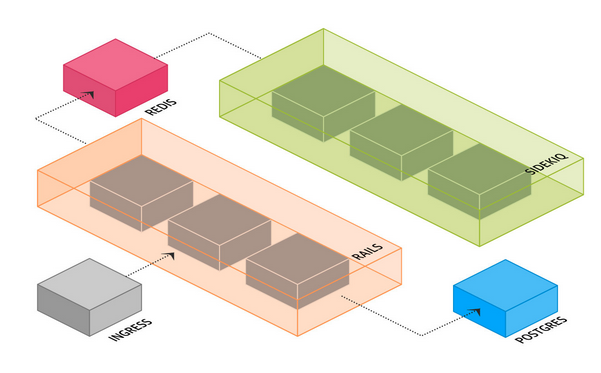

Sidekiq Worker K8s Builder
--------------------------

A script to generate independent sidekiq worker deployment files for all queue namespaces. I'm using it for Rails projects, but it can be adapted for other things as well. Here's the network model we're trying to create:




The goal is to have each sidekiq queue be it's own independently scalable replicaset so we can autoscale on these queue metrics.

## Setup

* wget the file to where you're building your workers. This is part of a gitlab CI pipeline for me, so I'm running this command in the dockerfile to spin up the runner.

  * `wget https://raw.githubusercontent.com/jtmkrueger/sidekiq_worker_k8s_builder/master/worker_builder.rb`

* you need a `config/sidekiq_workers.yml` that looks like this:
```
---
namespace: yourk8snamespace
queues:
  - name: default
    workers: 1
  - name: mailers
    workers: 1
```

* to run the file, just use ruby: `ruby worker_builder.rb`

## TODO

* add additional configuration to set up worker scaling (autoscaling rules, etc.)
* consider making this an executable script or maybe a binary
